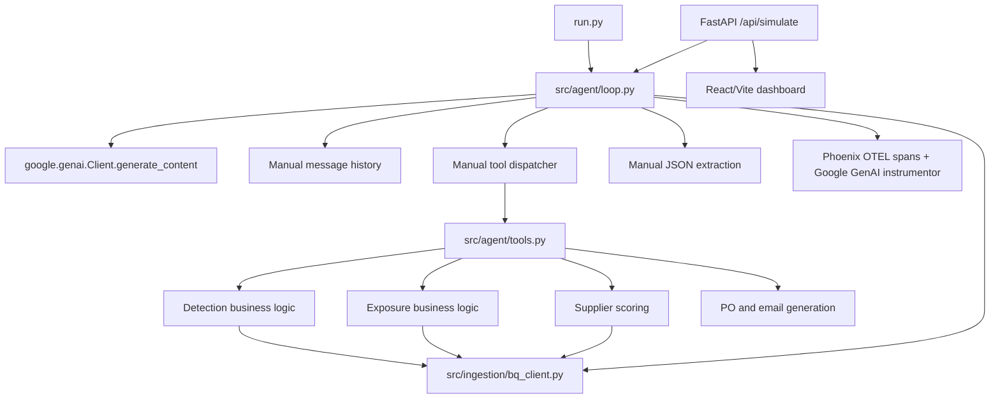
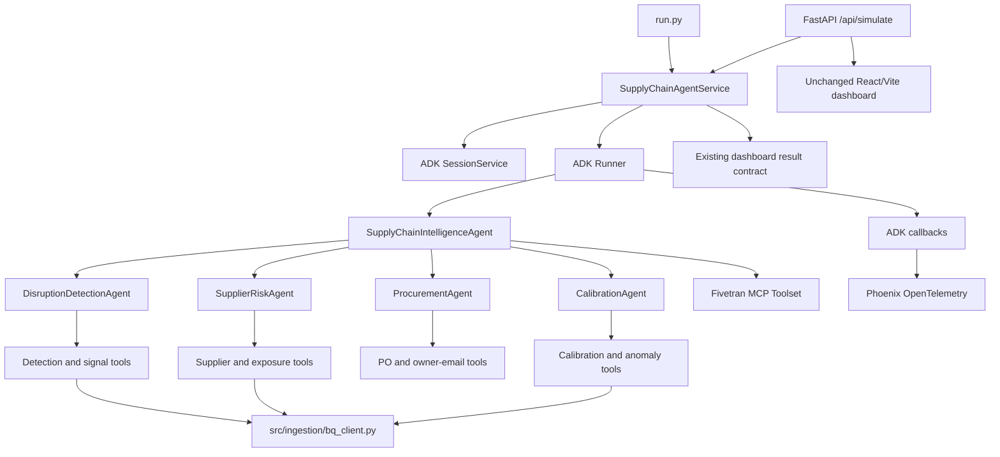

# Google ADK Migration Report

Date: 2026-06-09

## Executive Summary

The current application is not an agent framework application. It is a direct
`google-genai` client wrapped in a custom reasoning loop. The loop manually
maintains message history, declares Gemini function schemas, dispatches tool
calls, retries empty responses, parses final JSON, emits logs, and persists
alerts.

The migration will replace that layer with Google ADK 2.2.0:

- `LlmAgent` root and specialist agents
- ADK function tools backed by the existing business functions
- ADK `Runner` and `SessionService`
- ADK agent delegation and shared session state
- ADK model/tool callbacks for Phoenix-visible instrumentation
- ADK `McpToolset` support for Fivetran when configured

The BigQuery schemas, queries, business algorithms, dashboard routes, and
dashboard response shapes will remain unchanged.

## Current Architecture

## Current SDK and Orchestration Inventory

Direct Gemini SDK usage:

- `src/agent/loop.py`
  - imports `google.genai` and `google.genai.types`
  - constructs `genai.Client`
  - calls `client.models.generate_content`
  - manually processes function calls and function responses
- `src/agent/main.py`
  - constructs a second `genai.Client`
  - directly calls `client.models.generate_content`
- `src/agent/tools.py`
  - imports `google.genai.types`
  - manually declares every Gemini function schema
- `requirements.txt`
  - directly pins `google-genai`
  - pins the Google GenAI OpenInference instrumentor

Custom orchestration:

- `run_agent_cycle` owns the reasoning loop, maximum turns, empty-response
  retries, message history, tool dispatch, final-response detection, and JSON
  parsing.
- `handle_tool_call` is a custom tool registry/dispatcher.
- `run_loop` is the periodic scheduler.
- `_SimState` in `src/dashboard/api.py` is dashboard execution state, not
  conversational state. It will remain for live logs and concurrency control.

Current memory/state:

- Conversation history exists only in the local `messages` list.
- Tool history exists only in `tool_call_log`.
- The latest result and logs are process-local dashboard state.
- Historical calibration is durable business data in BigQuery, not agent
  conversational memory, and must remain there.

Entrypoints:

- `run.py`: one-shot or continuous agent execution
- `src/dashboard/api.py`: FastAPI backend and `/api/simulate`
- `src/agent/main.py`: environment/tracing smoke test
- `calibrate.py`: nightly calibration update, independent of the agent runtime

## Tool Candidate Inventory

ADK tools preserving existing implementations:

- `get_recent_disruptions`
- `get_business_suppliers`
- `get_pending_orders`
- `search_alternative_suppliers`
- `get_port_status`
- `get_inventory`
- `calculate_exposure`
- `detect_disruptions`
- `calculate_impact`
- `query_calibration_baseline`
- `detect_black_swan`
- `score_suppliers`
- `generate_purchase_order`
- `generate_owner_email`
- alert persistence/deduplication as an ADK-compatible tool/callback boundary

Business helpers that should remain internal rather than model-callable:

- raw BigQuery query functions
- shipment prediction and matching helpers
- business registry lookups
- calibration batch update
- dashboard CRUD endpoints

Fivetran MCP tools:

- `check_connector_status`
- `get_last_sync_time`
- `list_connectors`
- `trigger_sync`
- `monitor_sync`

These will be exposed through an ADK `McpToolset` when an MCP endpoint or
command is configured. A disabled, explicit toolset factory will preserve the
integration point without inventing a non-MCP implementation.

## Proposed ADK Architecture

## Agent Responsibilities

`SupplyChainIntelligenceAgent`

- owns the final decision and recommendation
- delegates specialist analysis
- can invoke Fivetran MCP tools when data freshness requires a sync
- produces the existing final JSON contract

`DisruptionDetectionAgent`

- analyzes disruption events, weather, ports, tariffs, and black-swan signals

`SupplierRiskAgent`

- calculates exposure, inventory coverage, geographic risk, and supplier rank

`ProcurementAgent`

- finds alternatives, drafts the selected purchase order, and drafts owner
  communication

`CalibrationAgent`

- retrieves historical calibration and applies confidence-aware guidance

## Files That Will Change

- `requirements.txt`
- `run.py`
- `README.md`
- `src/agent/__init__.py`
- `src/agent/main.py`
- `src/agent/loop.py` (removed or reduced to compatibility imports)
- `src/agent/tools.py` (remove GenAI schemas; preserve callable behavior)
- `src/dashboard/api.py`

No planned changes:

- `src/ingestion/bq_client.py`
- BigQuery schemas and seed data
- detection, exposure, supplier scoring, and prediction algorithms
- React/Vite dashboard behavior

## New ADK Files

- `src/agent/agent.py`: ADK-discoverable `root_agent`
- `src/agent/agents.py`: root and specialist agent factories
- `src/agent/runtime.py`: Runner/session lifecycle and compatibility result API
- `src/agent/session.py`: session service configuration
- `src/agent/observability.py`: Phoenix registration and ADK callbacks
- `src/agent/fivetran.py`: MCP toolset factory and configuration
- `src/agent/schemas.py`: structured final response models
- `tests/`: unit, tool, agent, runtime, and API compatibility tests

## Risks

1. ADK 2.x is new and introduces breaking changes from ADK 1.x. The migration
   targets installed/current `google-adk==2.2.0`.
2. ADK still depends on `google-genai` internally. "No direct SDK usage" means
   application code will not instantiate or call the GenAI client; the
   transitive package remains required by ADK.
3. Persistent ADK sessions require the ADK database extra and SQLAlchemy. The
   default will use `DatabaseSessionService` when configured and an in-memory
   service otherwise.
4. Model-generated structured output can vary. A Pydantic output schema,
   deterministic temperature, normalization, and compatibility tests will
   protect the dashboard contract.
5. Fivetran connection details are absent. The architecture can be first-class
   and runnable when configured, but live MCP integration cannot be verified
   without its endpoint/command and credentials.
6. Live Gemini, BigQuery, Phoenix Cloud, and Fivetran tests depend on external
   credentials and quotas. Automated tests will mock those boundaries while
   preserving opt-in integration tests.
7. Phoenix's Google GenAI-only instrumentor does not represent the full ADK
   graph. ADK-native OpenTelemetry auto-instrumentation and explicit callbacks
   will be used to retain model, agent, and tool visibility.

## Acceptance Criteria

- No application import of `google.genai` or direct `generate_content` call
- Root and four specialist agents are real ADK agents
- Existing business functions are registered as ADK tools
- Execution uses ADK Runner events and ADK sessions
- Fivetran is represented by an ADK MCP toolset
- Phoenix tracing remains configured and includes ADK execution/tool spans
- Existing API response fields remain available
- Unit, tool, agent, and end-to-end compatibility tests pass

## Reference Contract

- Google ADK 2.2.0 release:
  https://pypi.org/project/google-adk/
- ADK multi-agent architecture:
  https://github.com/google/adk-python
- ADK sessions, state, and memory:
  https://google.github.io/adk-docs/sessions/
- ADK Phoenix observability:
  https://google.github.io/adk-docs/observability/phoenix/
